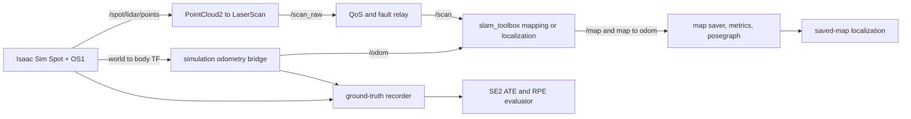
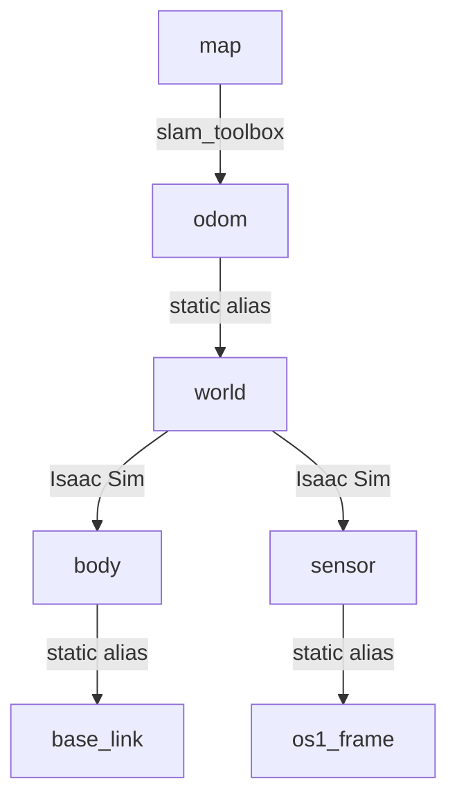

# Isaac Sim Spatial Intelligence Pipeline for AMR

## Final Classification

`PASS WITH LIMITATIONS`

The bounded Isaac Sim/ROS 2 pipeline, autonomous experiment harness,
repeatability baseline, real simulation ATE/RPE evaluation, saved-posegraph
localization tests, robustness cases, automated tests, and reproduction
documentation are complete. The project is not classified plain PASS because
map coverage remains below the portfolio target and saved-map localization is
not repeatably robust from every tested start.

This is simulation evidence only. It does not establish physical-robot
readiness.

## Project Overview

The project connects a Boston Dynamics Spot simulation in Isaac Sim 6.0 to
ROS 2 Jazzy. An Ouster OS1 publishes genuine PointCloud2 data, which is
projected to LaserScan for LiDAR-only `slam_toolbox` mapping and localization.
Odometry is explicitly simulation-derived. A bounded harness validates topics
and TF, drives data-defined trajectories, saves genuine maps and posegraphs,
calculates metrics, supervises processes, and preserves run-scoped evidence.



TF ownership:



`map -> odom` belongs only to mapping/localization. The odometry bridge
publishes `/odom` but does not publish that TF edge or introduce a second
parent for `base_link`.

## Environment and Dependency Record

Observed on 2026-07-25:

| Item | Version or state |
| --- | --- |
| Host kernel | Linux 7.0.0-28-generic x86_64 |
| Python | 3.12.3 |
| Isaac Sim | 6.0, Kit 110 |
| ROS 2 | Jazzy |
| GPU | NVIDIA GeForce RTX 3060 Laptop GPU, 6144 MiB |
| NVIDIA driver | 580.159.03 |
| `pointcloud_to_laserscan` | installed at `/opt/ros/jazzy` |
| `slam_toolbox` | mapping and localization executables installed |
| `tf2_ros` | installed at `/opt/ros/jazzy` |
| Nav2 map server / AMCL | not installed and not required by the selected backend |
| Source USD SHA-256 | `a265e9c596b100ebc95f0af0f41088854397b828f2ab8ddffaa5ad864df2fc6c` |
| Final implementation commit before this report | `4af11c4` |

The runtime uses current Isaac Sim 6.0 `isaacsim.*` APIs and an explicit
1280×720 `SimulationApp` configuration. The approved source stage was always
opened read-only and never saved.

## Reproduction Workflow

Run from the repository root. No sudo or package installation is required.

```bash
source /opt/ros/jazzy/setup.bash

python3 -m unittest discover -s tests -v
python3 -m compileall -q scripts launch tests
python3 scripts/100_run_autonomous_experiment.py \
  --config config/autonomous_runtime.yaml --dry-run

# Bounded live smoke
python3 scripts/100_run_autonomous_experiment.py \
  --config config/autonomous_runtime.yaml --smoke

# Selected mapping baseline and three-run repeatability
python3 scripts/100_run_autonomous_experiment.py \
  --config config/m10_repeatability.yaml

# Serialize a genuine localization posegraph
python3 scripts/100_run_autonomous_experiment.py \
  --config config/m12_posegraph_mapping.yaml

# Use the generated posegraph paths in config/m12_localization.yaml
python3 scripts/100_run_autonomous_experiment.py \
  --config config/m12_localization.yaml

# Run robustness cases independently so expected faults stop immediately
python3 scripts/100_run_autonomous_experiment.py \
  --config config/m13_robustness.yaml --experiment normal_baseline
python3 scripts/100_run_autonomous_experiment.py \
  --config config/m13_robustness.yaml --experiment controlled_scan_dropout
python3 scripts/100_run_autonomous_experiment.py \
  --config config/m13_robustness.yaml --experiment recovery_after_dropout
```

The measured localization configuration pins the immutable posegraph created
by the recorded Milestone 12 mapping run. A fresh mapping run creates a new
unique directory; update only `map_file_name` and `immutable_inputs` to that
new prefix. Do not overwrite the recorded posegraph.

Every harness run creates a unique no-overwrite directory containing its
effective configuration, Git revision, UTC timestamps, process logs, step
evidence, manifest, CSV, and report. It enforces the declared time/output
limits and records cleanup and source-USD hashes.

## Milestone Summary

| Milestone | Classification | Gate result |
| --- | --- | --- |
| 8 | WARN | Genuine SLAM map, but only 0.0153 known ratio and 30 occupied cells |
| 9A | PASS | Harness static/dry/live smoke and owned-process cleanup pass |
| 9B | WARN | Measured and reproducible improvement; 0.10/500 targets not met |
| 10 | PASS | Three identical runs; no major variance |
| 11 | PASS WITH LIMITATIONS | Real synchronized ATE/RPE, deterministic replay |
| 12 | WARN | Original/recovery successes, east and repeated-recovery failures |
| 13 | PASS | Six declared baseline/fault/recovery expectations met |
| 14 | PASS WITH LIMITATIONS | Tests, dry run, evidence links, and report validated |

## Baseline Configuration

The selected reproducible simulation baseline is:

```text
LiDAR profile: wide_diagnostic
min_height: -0.50 m
max_height:  0.50 m
range_min:   0.20 m
range_max:  20.0 m
angle_min:  -3.14159 rad
angle_max:   3.14159 rad
trajectory: warehouse_mapping_loop
speed:       0.30 m/s
waypoints:   data-defined in config/trajectories.json
map target:  known_ratio >= 0.10 and occupied_cells >= 500
```

The targets were not lowered.

## Experiment Results

| Experiment | Directly observed result |
| --- | --- |
| Milestone 8 inherited baseline | known 0.0153, occupied 30, WARN |
| M9 `baseline_m08` | known 0.020394, occupied 98 |
| M9 `wide_diagnostic` | known 0.023300, occupied 279; selected |
| M9 `front_180_only` | known 0.020004, occupied 49 |
| M9 `near_range_only` | finite `/scan` loss detected; FAIL |
| M10 repeatability | three complete 641×659 maps; statistical PASS |
| M11 trajectory error | 956 synchronized pairs; PASS WITH LIMITATIONS |
| M12 localization | two successful cases, two quantitative failures; WARN |
| M13 robustness | all six declared expectations met; PASS |

### Best genuine map

The best recorded repeatability map passed artifact validation again during
finalization:

```text
dimensions:      641 x 659 cells
resolution:      0.05 m/cell
known_ratio:     0.023339
occupied_cells:  281
unknown_ratio:   0.976661
known area:      24.648 m²
```

Relative to Milestone 8, known ratio improved about 52.5% and occupied cells
increased from 30 to 281. It remains WARN because coverage is far below 0.10
and occupied cells are below 500.

Three identical M10 runs produced:

```text
known ratio CV:      0.00880
occupied cells CV:   0.01033
duration CV:         0.00424
scan frequency CV:   0.00559
map dimensions CV:   0
major variance:      false
```

### ATE/RPE

The real simulation run recorded 2,871 Isaac `world -> body` samples and 956
simulation-derived `/odom` samples. One-to-one matching within 0.05 seconds
produced 956 pairs.

| Metric | RMSE | P95 | Maximum |
| --- | ---: | ---: | ---: |
| ATE translation | 0.010305 m | 0.001020 m | 0.192897 m |
| ATE rotation | 0.000159 rad | 0.000131 rad | 0.001813 rad |
| RPE translation | 0.004472 m | 0.000437 m | 0.075597 m |
| RPE rotation | 0.000122 rad | ~0 rad | 0.001944 rad |

Replay over the same immutable CSV inputs produced byte-identical JSON and
series hashes. Because `/odom` is derived from the Isaac ground-truth TF, these
numbers measure bridge timing/sampling behavior, not independent estimator or
physical localization accuracy.

### Saved-map localization

The posegraph and dataset hashes remained unchanged before/after every run.
The original pose passed. A deliberately imperfect recovery guess passed once
at 0.164 m/0.00691 rad residual but failed on an identical retry at
1.013 m/0.0802 rad. A 0.5 m east start failed at 1.074 m/0.105 rad. All
selected transforms were stationary-stable; the sparse map permits stable but
incorrect scan-matching solutions.

### Robustness

| Scenario | Result |
| --- | --- |
| Normal baseline | operational PASS at 1.964 Hz |
| Every second scan | operational PASS at 0.976 Hz |
| 10-second scan dropout | absence detected; controlled stop |
| Fresh post-dropout run | recovered in 14.948 s preflight at 1.956 Hz |
| 10 m range limit | finite scan failure detected |
| 10-second delayed SLAM | recovered in 15.346 s preflight |

No failure was converted into a pass. Expected fault detections required
confirmed process cleanup and unchanged source USD.

## Known Limitations and Unresolved WARN/FAIL Items

- Map quality is WARN: 2.33% known versus 10% target; 281 occupied cells
  versus 500 target.
- No RViz screenshot was captured for the optimized map; machine-readable
  scan, TF, map, and artifact evidence is available.
- The 10 m range profile and controlled dropout intentionally produce detected
  failures.
- Saved-map localization failed from the east start and was not repeatable for
  the recovery input.
- Simulation-derived odometry re-expresses Isaac ground truth; it is not
  independent wheel, leg, visual, or inertial odometry.
- ATE/RPE is planar-yaw aligned; roll and pitch are not scored.
- No camera/IMU fusion or physical sensor fusion is implemented.
- Collision safety is limited to validated runtime-relative permitted-area
  bounds because the inherited kinematic controller exposes no collision
  callback.
- No physical-robot deployment, calibration, networking, safety certification,
  or readiness claim is made.

## Troubleshooting

- GPU gate fails: run `nvidia-smi -L`; do not bypass `runtime.require_gpu`.
- Isaac starts but no LiDAR: verify the approved stage contains
  `/World/spot_lidar_realsense/body/lidar_link/OS1/sensor` and allow the RTX
  sensor warmup within the 30-second topic timeout.
- `/scan` is absent or has no finite values: inspect PointCloud2 frame
  `sensor`, converter slice/range, relay controls, and `os1_frame`.
- `/map` or `map -> odom` is absent: confirm advancing `/clock`, `/odom`,
  finite `/scan`, valid aliases, and active `slam_toolbox`.
- Localization does not load: provide the posegraph prefix without the
  `.posegraph` suffix and verify both `.posegraph` and `.data` hashes.
- Localization selects a stable wrong solution: retain the failure, improve
  map coverage/structure, then repeat with unchanged quantitative thresholds.
- A run stops after a fault: inspect its final validator log and
  `cleanup_confirmed`; start a new immutable recovery run.
- Never reduce quality or convergence thresholds merely to force PASS.

## Evidence Index

Project contracts and milestone reports:

- [ROS 2 topic contract](ros2_topic_contract.md)
- [Autonomous runtime harness](autonomous_runtime_harness.md)
- [Milestone 9 map optimization](milestone_09_map_quality_improvement.md)
- [Milestone 10 repeatability](milestone_10_repeatable_trajectories.md)
- [Milestone 11 ATE/RPE](milestone_11_ground_truth_evaluation.md)
- [Milestone 12 localization](milestone_12_localization.md)
- [Milestone 13 robustness](milestone_13_robustness.md)
- [Mission journal](../artifacts/experiments/mission_journal.md)

Configurations:

- [Harness baseline](../config/autonomous_runtime.yaml)
- [LiDAR profiles](../config/m09_lidar_slice_profiles.yaml)
- [Repeatability baseline](../config/m10_repeatability.yaml)
- [Trajectories](../config/trajectories.json)
- [ATE/RPE run](../config/m11_evaluation.yaml)
- [Localization run](../config/m12_localization.yaml)
- [Robustness matrix](../config/m13_robustness.yaml)

Runtime evidence:

- [Post-commit Milestone 14 dry-run manifest](../artifacts/autonomous_runs/run_20260725T165637_208141_9d6a40c0/manifest.json)
- [Milestone 9A live manifest](../artifacts/autonomous_runs/run_20260725T152626_64594_54de0973/manifest.json)
- [M9 comparison JSON](../artifacts/m09_matrix/summary_20260725T1549/m09_experiments.json)
- [M9 comparison CSV](../artifacts/m09_matrix/summary_20260725T1549/m09_experiments.csv)
- [M10 repeatability manifest](../artifacts/m10_repeatability/run_20260725T155013_102304_7bb8f0b1/manifest.json)
- [M10 statistics JSON](../artifacts/m10_repeatability/summary_20260725T1605/repeatability.json)
- [Best map stats](../artifacts/m10_repeatability/run_20260725T155013_102304_7bb8f0b1/experiment_1_repeatability_1/maps/map_20260725_155443/map_stats.json)
- [M11 capture metadata](../artifacts/m11/pose_capture_20260725T1616/metadata.json)
- [M11 ATE/RPE JSON](../artifacts/m11/evaluation_20260725T1620/trajectory_error.json)
- [M11 ATE/RPE series](../artifacts/m11/evaluation_20260725T1620/trajectory_error_series.csv)
- [M12 posegraph manifest](../artifacts/m12_mapping/run_20260725T162421_157320_5c77b261/manifest.json)
- [M12 original/east results](../artifacts/m12_localization/run_20260725T163303_171068_a9edd193/manifest.json)
- [M12 recovery PASS](../artifacts/m12_localization/run_20260725T163556_176333_0d4c2bc4/manifest.json)
- [M12 recovery retry FAIL](../artifacts/m12_localization/run_20260725T163752_179930_50f1fa71/manifest.json)
- [M13 robustness JSON](../artifacts/m13_robustness/summary_20260725T1651/robustness.json)
- [M13 robustness CSV](../artifacts/m13_robustness/summary_20260725T1651/robustness.csv)

No source USD was overwritten. No sensor message, map, pose, transform,
measurement, screenshot, or PASS result was fabricated.
