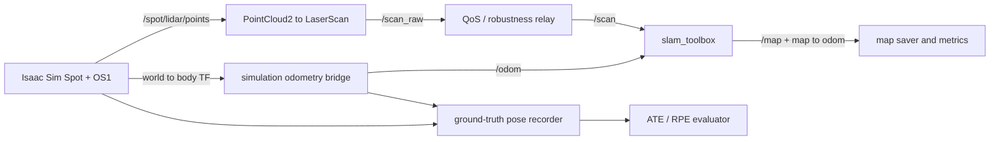
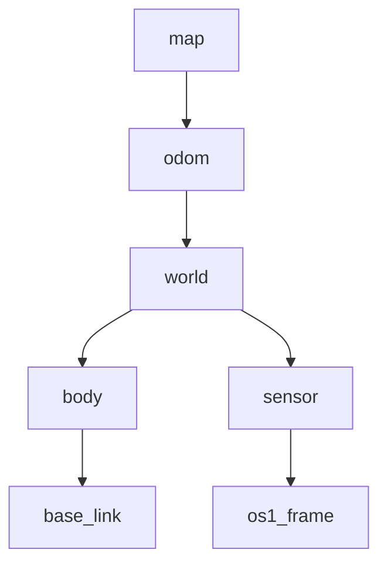

# Isaac Sim Spatial Intelligence Pipeline for AMR

## Final Classification

`BLOCKED`

The static implementation, unit tests, contract regressions, and fresh dry run
pass. Runtime Milestones 9B–13 cannot satisfy their evidence gates because the
current environment has no usable NVIDIA driver. No physical-robot readiness,
portfolio-quality map, real ATE/RPE, localization convergence, or robustness
PASS is claimed.

## Project Overview

This project connects a Boston Dynamics Spot simulation in Isaac Sim 6.0 to
ROS 2 Jazzy for Ouster PointCloud2 projection, simulation-derived odometry,
LiDAR SLAM, bounded mapping experiments, map validation, trajectory-error
evaluation, and regression checks.



Validated TF ownership remains:



`map -> odom` belongs to SLAM/localization. Isaac publishes `world -> body`;
the aliases do not replace Isaac frames. The Milestone 6 `/odom` is derived
from Isaac TF and is not independent physical odometry.

## Environment and Dependencies

| Item | Observed state |
| --- | --- |
| Isaac Sim | 6.0 |
| ROS 2 | Jazzy |
| `pointcloud_to_laserscan` | installed |
| `slam_toolbox` | installed |
| `tf2_ros` | installed |
| NVIDIA runtime | BLOCKED: `nvidia-smi -L` return code 9 |
| Nav2 map server / AMCL / lifecycle manager | not installed |
| Git revision recorded by dry run | `6de870f4a9542c55c718040e95d0d015380731ac` |

## Reproduction Workflow

From the repository root:

```bash
python3 -m unittest discover -v tests
python3 -m compileall -q scripts launch tests
python3 scripts/100_run_autonomous_experiment.py \
  --config config/autonomous_runtime.yaml \
  --dry-run
```

After `nvidia-smi -L` reports a usable GPU:

```bash
python3 scripts/100_run_autonomous_experiment.py \
  --config config/autonomous_runtime.yaml \
  --smoke
python3 scripts/100_run_autonomous_experiment.py \
  --config config/m09_experiment_matrix.yaml
python3 scripts/100_run_autonomous_experiment.py \
  --config config/m10_repeatability.yaml
```

Every run creates a unique non-overwriting directory, records exact effective
configuration and Git revision, enforces bounded runtime/output, hashes the
source USD, and confirms child-process cleanup.

## Milestone Summary

| Milestone | Classification | Evidence |
| --- | --- | --- |
| 8 | WARN | Genuine map and TF; sparse map |
| 9A | PASS static/dry; live BLOCKED | Harness, 10 tests, dry run |
| 9B | BLOCKED | Diagnostics/matrix ready; no live measurements |
| 10 | BLOCKED | Three data trajectories and statistics ready; no three-run batch |
| 11 | BLOCKED | Recorder/evaluator and synthetic tests ready; no real pose series |
| 12 | BLOCKED | No saved map/posegraph and localization packages unavailable |
| 13 | BLOCKED | Five reversible scenarios and contract tests ready; no runtime |
| 14 | BLOCKED | Reproducibility package complete; runtime evidence incomplete |

## Baseline and Experiment Table

The inherited scan baseline is `min_height=-0.20`, `max_height=0.20`,
`range_min=0.20`, `range_max=20.0`, and full 360-degree coverage. Initial
portfolio targets remain `known_ratio >= 0.10` and `occupied_cells >= 500`.

| Experiment | Declared input | Observed result |
| --- | --- | --- |
| Milestone 8 baseline | inherited live run | known ratio 0.0153; occupied 30; WARN |
| Milestone 9 matrix | four one-factor profiles, same route | BLOCKED; not run |
| Milestone 10 repeatability | three identical profile/trajectory runs | BLOCKED; not run |
| Milestone 11 ATE/RPE | synchronized `world -> body` and `/odom` | synthetic tests PASS; real run BLOCKED |
| Milestone 12 localization | saved immutable map | BLOCKED; artifact absent |
| Milestone 13 robustness | baseline + four reversible perturbations | BLOCKED; not run |

The best directly observed map remains the Milestone 8 WARN result:
`known_ratio=0.0153`, `occupied_cells=30`, `unknown_ratio=0.9847`. No saved
final map path is available, so it is not presented as a reproducible baseline.

## Results and Limitations

- ATE/RPE: synthetic rigid-alignment tests pass; no real simulation result.
- Localization: no convergence result, alternate-start test, or recovery test.
- Robustness: expected outcomes are declared; no recovery times are measured.
- Ground truth: Isaac `world -> body`.
- Odometry: simulation-derived from Isaac TF, not a physical estimator.
- SLAM: LiDAR-only `slam_toolbox` output.
- Physical sensor fusion: not implemented.
- Source USD: SHA-256 remained
  `a265e9c596b100ebc95f0af0f41088854397b828f2ab8ddffaa5ad864df2fc6c`;
  no USD diff exists.
- Git commit: not created because `.git` is read-only in this execution
  sandbox.

## Troubleshooting

- `nvidia-smi -L` return code 9: restore host NVIDIA driver/device visibility;
  do not bypass `runtime.require_gpu`.
- Isaac starts but LiDAR prim is missing: verify the approved Warehouse USD
  resolves `/World/spot_lidar_realsense/body/lidar_link/OS1/sensor`.
- `/scan` absent: verify `/spot/lidar/points`, `os1_frame`, and the QoS relay.
- `/map` absent: verify `/clock`, TF, `/odom`, `/scan`, and `slam_toolbox`
  lifecycle state before motion.
- Localization blocked: provide validated immutable map artifacts and either a
  slam_toolbox posegraph or approved installed Nav2 localization packages.
- Never lower quality thresholds merely to force PASS.

## Evidence Index

- [ROS 2 topic contract](ros2_topic_contract.md)
- [Milestone 8 observed map metrics](milestone_08_map_saving_replay_evaluation.md)
- [Milestone 9A harness and blocker](autonomous_runtime_harness.md)
- [Milestone 9B optimization plan](milestone_09_map_quality_improvement.md)
- [Milestone 10 trajectories](milestone_10_repeatable_trajectories.md)
- [Milestone 11 ATE/RPE](milestone_11_ground_truth_evaluation.md)
- [Milestone 12 localization blocker](milestone_12_localization.md)
- [Milestone 13 robustness](milestone_13_robustness.md)
- [Autonomous baseline configuration](../config/autonomous_runtime.yaml)
- [Milestone 9 experiment matrix](../config/m09_experiment_matrix.yaml)
- [Trajectory data](../config/trajectories.json)
- [Fresh dry-run manifest](../artifacts/autonomous_runs/run_20260725T150051_3_edc36caa/manifest.json)
- [Bounded live-smoke failure report](../artifacts/autonomous_runs/run_20260725T141127_3_2b1a56eb/report.md)
- [Append-only mission journal](../artifacts/experiments/mission_journal.md)

Unresolved items are explicit: GPU runtime unavailable, Milestone 9 quality
targets unmeasured, three-run repeatability absent, real ATE/RPE absent, saved
map/posegraph absent, localization packages absent, and robustness recovery
unmeasured.
